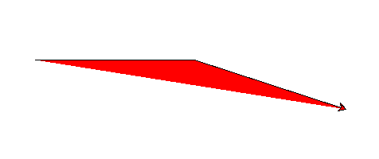
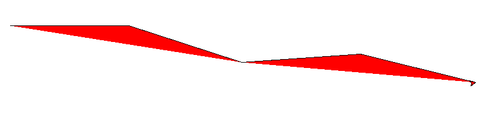
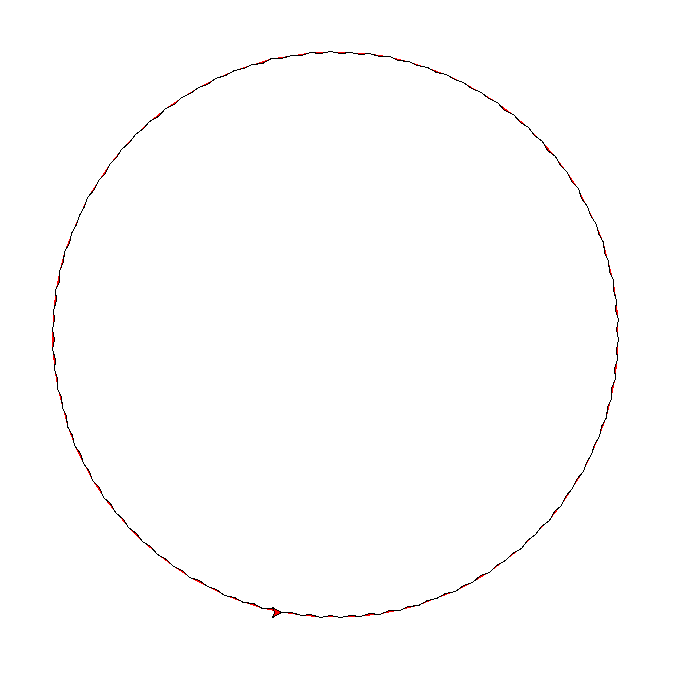
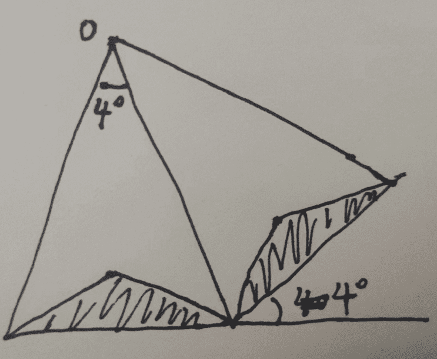

# 万花筒

View the python code from Youtube

## python

1. 构建三角形`Tri`

   边为 100, 顶角为 162° 的等腰三角形

   

2. 下一个三角形偏离原来 4°

   

   如果有 90 个, 则会构造出一圈的圆圈

   

   相当于有如下的一个三角形

   

   于是可以用圆来构造, 即$(cos(x), sin(x))$, 而不是偏离原来的 4° 来构造

3. 取出圆上的 16 个, 作为一片叶子

4. 将叶子旋转 124°

   90 个图形

5. done

## Haskell

有两种设计思路:

- 通过圆来构造, 当作一个整体, 画闭合的图形

  生成点列, 弦可以用 list comprehensive

- 通过三角形来不断变换

  $$T_{n} = A \cdot T_{n-1}$$

  两种变换方法:

  - 通过圆心圆转, 最后某一段平移到原点处
  - 通过原点的三角形进行矩阵变换
