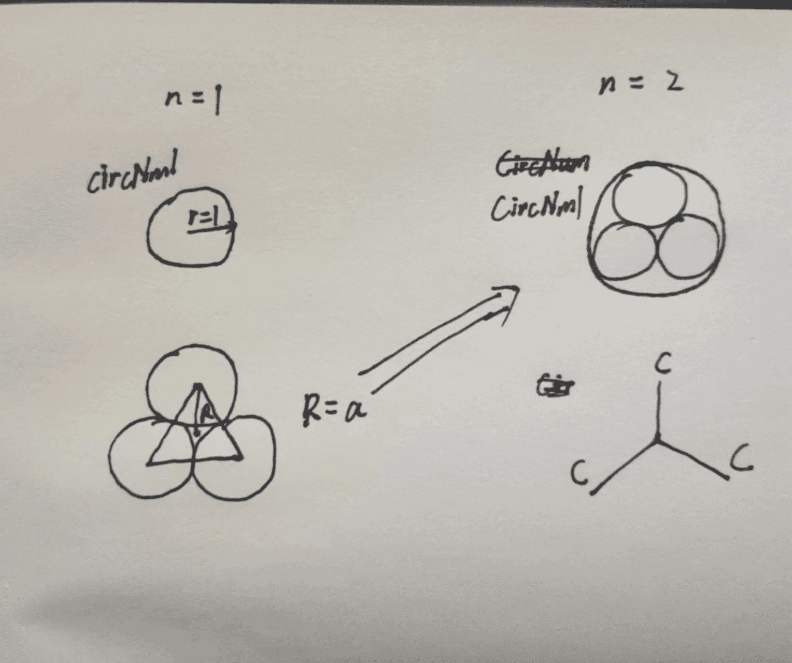

# Clock

[](Main.hs ":include :type=code hs")

## explanation

lines

$$1 + b^2 = a^2$$

保证了半径相同

---

```hs
circNm1
    = Pictures
        [ circle 1
        , Scale (a/2.5) (a/2.5) $ clockFractal (n-1) s
        , if n > 2
            then Color cyan
                        $ Translate (-0.15) 1
                        $ Scale 0.001 0.001
                        $ Text (show s)
            else Blank
        ]
```

子图形为`circle 1` + `Scale (a/2.5) (a/2.5) $ clockFractal (n-1) s`

严格来`a/2.5`应该为`1/(1+a)`

```txt
ghci> a = 1 / sin (2 * pi / 6)
ghci> 1 / (1+a)
0.4641016151377546
ghci> a / 2.5
0.46188021535170065
```



然后将子图形构造出当前的图形

### velocity

最外面的, 也是整体的速度, 不是在递归里面设置的, 而是下面的语句

```hs
frame   time
        = Color white
        $ Scale 120 120
        $ Rotate (time * 2*pi)
        $ clockFractal 5 time
```

`Rotate (time * 2*pi)`设置了旋转速度

---

里面的速度是根据`50 * s * (log (1 + nf))`来设置的, 外面的 n 大, 里面的 n 小, 外面转的快

注意和整体的速度区分, 即`Rotate (time * 2*pi)`
